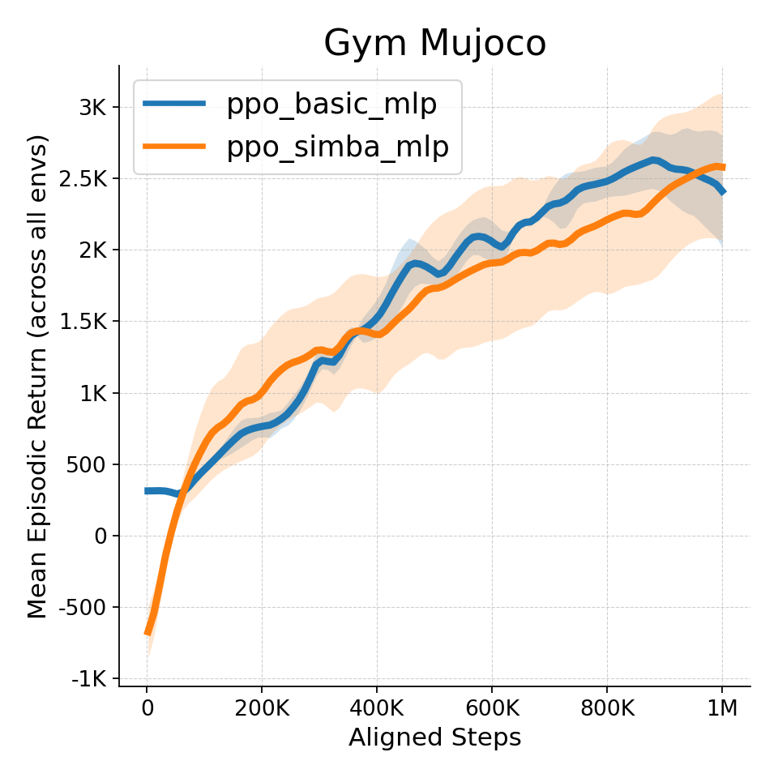
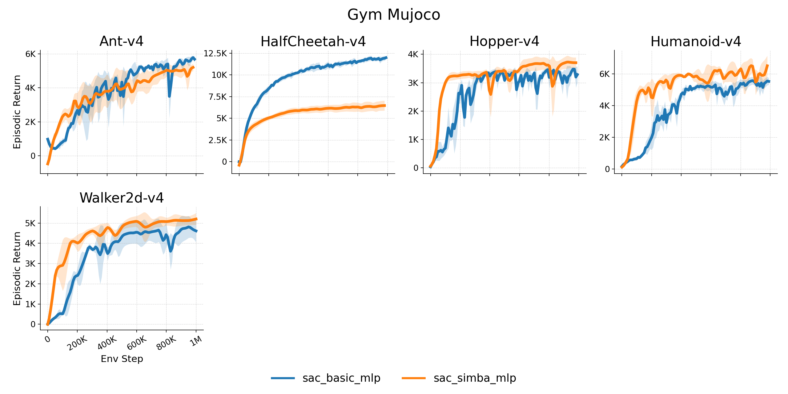
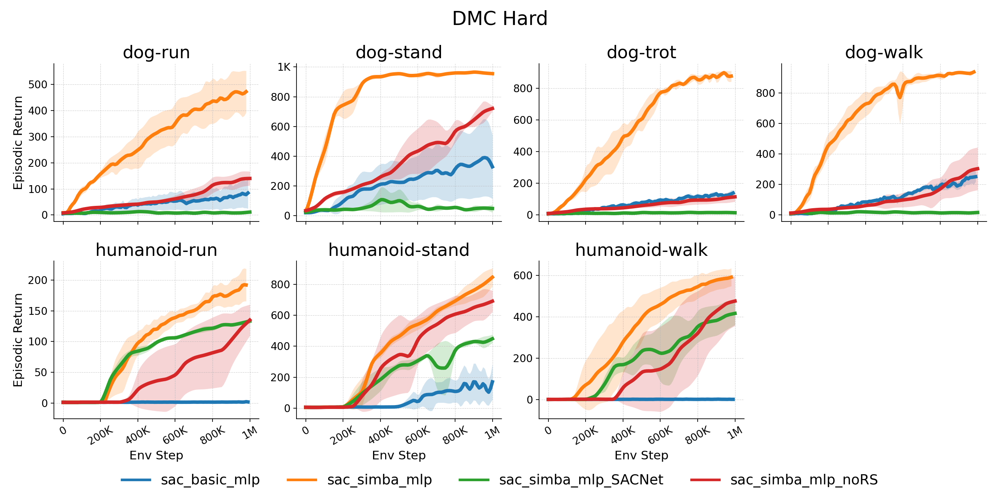

# KataRL2

> [KataRL](https://github.com/wty-yy/katarl)第一版使用的是JAX，但结构布局错乱因此弃用

算法全部使用PyTorch实现，参考
- [cleanrl](https://github.com/vwxyzjn/cleanrl)保持简洁性
- [stable-baselines3](https://github.com/DLR-RM/stable-baselines3.git)保持易用性
- [tyro](https://github.com/brentyi/tyro)利用Python的field对变量配置进行管理, 并支持美观的CLI解析
- [simba](https://github.com/SonyResearch/simba)复现论文中的SimbaSAC算法（原仓库为JAX版本）

## 特点
简单的代码结构, 没有复杂的继承关系, 易于添加自定义算法, 有benchmark和绘图脚本, 便于在不同环境中多个随机种子下比对各种算法性能

1. 便捷的模型保存与加载 (类似stable baselines3的易用性)
2. 使用`tyro`方便地进行参数管理, 可通过命令行传参控制所有内参
3. 支持`swanlab`, `wandb`训练曲线上传
4. 环境使用`gymnasium`标准, 易于添加自定义环境
5. 相比`cleanrl`, `stable baselines3`更加高效, 减少冗余信息输出并减少嵌套代码
6. 用python脚本方便地启动`benchmark`测试 (启动不同算法, 不同环境, 不同种子的实验)
7. 支持模型的训练曲线保存, 保持日志文件路径规范, 自动读取tensorboard日志整理绘制曲线图

## 支持
### 算法
| 算法 | `Box` | `Discrete` | `MultiDiscrete` | 网络结构 |
| - | - | - | - | - |
| SAC | ✔️ | ❌️ | ❌️ | MLP |
| SimbaSAC | ✔️ | ❌️ | ❌️ | MLP |
| PPO | ✔️ | ✔️ | ❌️ | MLP, CNN+MLP |
| SimbaPPO | ✔️ | ✔️️ | ❌️ | MLP, CNN+MLP |

### 环境
1. gymnaisum: mujoco-py
2. dm_control

## 运行环境安装
1. 最简安装
```bash
# conda创建环境并安装
conda env create -f requirements/conda_requirements.yaml
# pip安装
pip install -r requirements/requirements.txt
```

2. 完全安装 (包含全部交互环境)
```bash
# conda创建环境并安装
conda env create -f requirements/conda_requirements_full.yaml
# pip安装
pip install -r requirements/requirements_full.txt
```

### 可选安装
上传tensorboard日志信息
- `swanlab`: `pip install swanlab`
- `wandb`: `pip install wandb` (中国大陆无法访问)

智能体交互环境 (完全安装中包含)
- `gymnasium`:
    - `mujoco-py`: `pip install "gymnasium[mujoco]"`
    - 视频录制: `pip install "gymnasium[other]"` (包含opencv-python, matplotlib, tqdm, imageio, pandas)

## 使用方法
### 算法
1. 所有的`benchmark`启动代码位于[`./benchmarks`](./benchmarks/)文件夹下, 通过`nohup`来启动后台命令, 因此`benchmarks`运行仅支持Linux, 产生的后台日志保存在`./logs/runs/log_*.out`中
2. 所有的算法启动样例位于`demos/algo.py`中, 其中`algo`为对应的算法名, `benchmark`代码也是通过启动`demos`中的算法来启动多个实验
3. 每个算法位于`katarl2/agents/algo`文件夹下, 每个算法为一个单独的文件夹, 便于修改调试
4. 推荐每个算法继承基类[`Agent`](./katarl2/agents/common/agent.py), 包含如下函数: `__init__`, `learn`, `predict`, `eval`, `save`, `load`实现方法可自行确定 (不做强制限制, 只需在`demos`中的启动样例中说明用法即可, **尽可能简单易用**)
5. 推荐每个算法配置文件继承类[`AgentConfig`](./katarl2/agents/common/agent_cfg.py), 这包含配置智能体训练+推理所需的最小参数

**注意**:
1. 所有日志中曲线的`x`轴为`env_step`也就是总环境推进步数, 也是`interaction_step * env.repeat_action * num_envs`, 其中`iteraction_step`为智能体执行`step()`的次数, `repeat_action`为每个`action`的重复次数, `num_envs`为总并行环境数

### 环境
1. 所有环境位于`katarl2/envs/env_*.py`下, 所有环境均为`gymnasium`标准, 支持的状态、动作空间均继承`gym.Spaces` (连续`Box`, 离散`Discrete`, 多维离散`MultiDiscrete`)
2. 并行环境的使用`gym.vector.SyncVectorEnv`即(伪)多线程并行, 由[`env_maker.py`](./katarl2/envs/env_maker.py)完成
3. 所有**训练环境均默认为并行环境**
4. 推荐环境配置文件继承类[`EnvConfig`](./katarl2/envs/common/env_cfg.py), 这包含了环境配置所需的最小参数

## 可能的报错
1. `mujoco.FatalError: an OpenGL platform library has not been loaded into this process, this most likely means that a valid OpenGL context has not been created before mjr_makeContext was called`, 设置环境变量`conda env config vars set MUJOCO_GL=egl`, 重启`conda`环境即可

## 完成的实验
以下图片均由[plot_tb_graphs.py](./demos/common/plot_tb_graphs.py)和[plot_tb_graphs_compare_env_suits](./demos/common/plot_tb_graphs_compare_env_suits.py)完成, 绘制命令请见[plot_commands.md](./assets/figures/plot_commands.md)
### PPO vs Simba
<details>
    <summary>atari</summary>
    
    
</details>
<details>
    <summary>gym mujoco</summary>
    
    
</details>
<details>
    <summary>dmc hard</summary>
    
    
</details>
<details>
    <summary>atari envpool vs gymnasium</summary>
    
</details>

### SAC vs Simba
<details>
    <summary>gym mujoco</summary>
    
    
</details>
<details>
    <summary>dmc easy</summary>
    
    
</details>
<details>
    <summary>dmc hard</summary>
    
    
</details>

### SAC vs PPO vs Simba
<details>
    <summary>gym mujoco</summary>
    
    
</details>
<details>
    <summary>dmc hard</summary>
    
    
</details>

## 致谢
- @[wertyuilife2](https://github.com/wertyuilife2): SimbaV2网络torch版结构测试
