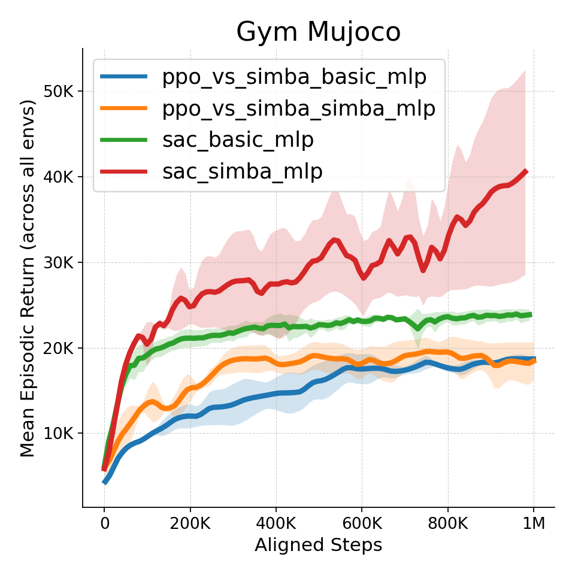

## 日志数据下载
1. [sac_simba_mujoco_dmc_logs.tar.xz](https://ecnhf41t16x1.feishu.cn/file/CjHMbc2NqoiNC5x0AyHcAkDfn1g)
2. [ppo_simba_atari_mujoco_dmc_logs.tar.xz](https://ecnhf41t16x1.feishu.cn/file/HS8XbjVDnoM39exe8J1cudJ1nkc)

注意: 下面在gym-mujoco上的测试均没有绘制`HumanoidStandup-v4 InvertedPendulum-v4 Pusher-v5`这三个环境，因为奖励图像差异是在过大

<details>
    <summary>gym-mujoco上三个极端奖励环境 (左图为不加, 右图为全部环境)</summary>
    
    
</details>

## ppo
### atari
```bash
python demos/common/plot_tb_graphs.py --avail-algos ppo --ignore-env-suit-name \
    --avail-suits envpool \
    --plot-summary --title "Atari-10M"
```
### gym mujoco
```bash
python demos/common/plot_tb_graphs.py --avail-algos ppo --ignore-env-suit-name \
    --avail-suits gymnasium \
    --avail-envs Ant-v4 HalfCheetah-v4 Hopper-v4 Humanoid-v4 Walker2d-v4 \
    --plot-summary --title "Gym Mujoco"
    # HumanoidStandup-v4 InvertedPendulum-v4 Pusher-v5 \
```
### dmc hard
```bash
python demos/common/plot_tb_graphs.py --avail-algos ppo --ignore-env-suit-name \
    --avail-suits dmc \
    --avail-envs dog-run dog-stand dog-trot dog-walk humanoid-run humanoid-stand humanoid-walk \
    --plot-summary --title "DMC Hard"
```
### atari envpool vs gymnasium
```bash
python demos/common/plot_tb_graphs_compare_env_suits.py --logdir ./logs/ppo/basic_discrete_cnn+mlp
```

## sac vs simba
### gym mujoco
```bash
python demos/common/plot_tb_graphs.py --avail-algos sac --ignore-env-suit-name \
    --avail-suits gymnasium \
    --avail-envs Ant-v4 HalfCheetah-v4 Hopper-v4 Humanoid-v4 Walker2d-v4 \
    --avail-family-algos basic_continuous_mlp simba_continuous_mlp \
    --plot-summary --title "Gym Mujoco"
    # HumanoidStandup-v4 InvertedPendulum-v4 Pusher-v5 \
```
### dmc easy
```bash
python demos/common/plot_tb_graphs.py --avail-algos sac --ignore-env-suit-name \
    --avail-suits dmc \
    --avail-envs acrobot-swingup cartpole-balance cartpole-balance_sparse cartpole-swingup cartpole-swingup_sparse \
    cheetah-run finger-spin finger-turn_easy finger-turn_hard fish-swim hopper-hop hopper-stand \
    pendulum-swingup quadruped-walk quadruped-run reacher-easy reacher-hard walker-stand walker-walk walker-run \
    --plot-summary --title "DMC Easy"
```
### dmc hard simba ablation
```bash
python demos/common/plot_tb_graphs.py --avail-algos sac --ignore-env-suit-name \
    --avail-suits dmc \
    --avail-envs dog-run dog-stand dog-trot dog-walk humanoid-run humanoid-stand humanoid-walk \
    --plot-summary --title "DMC Hard"
```

## sac vs ppo vs simba
### gym mujoco
```bash
python demos/common/plot_tb_graphs.py --avail-algos sac ppo --ignore-env-suit-name \
    --avail-suits gymnasium \
    --avail-envs Ant-v4 HalfCheetah-v4 Hopper-v4 Humanoid-v4 Walker2d-v4 \
    --avail-family-algos basic_continuous_mlp simba_continuous_mlp \
    --plot-summary --title "Gym Mujoco"
    # HumanoidStandup-v4 InvertedPendulum-v4 Pusher-v5 \
```
### dmc hard
```bash
python demos/common/plot_tb_graphs.py --avail-algos sac ppo_vs_simba_continuous --ignore-env-suit-name \
    --avail-suits dmc \
    --avail-envs dog-run dog-stand dog-trot dog-walk humanoid-run humanoid-stand humanoid-walk \
    --avail-family-algos basic_continuous_mlp simba_continuous_mlp \
    --plot-summary --title "DMC Hard"
```